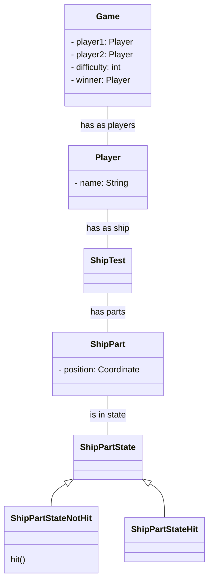

# Schiffe versenken
## Projektidee
Ein simples "Schiffe versenken" Spiel, welches zwei Spieler gegeneinander Spielen lässt. Das Spielfeld ist im Stil eines Rasters und die Schiffe werden durch durch ausgemalte Rasterkästchen repräsentiert. Man kann zwischen zwei Spielversionen auswählen und je nach Auswahl gibt es eine andere Konfiguration von Schiffen.
Wird ein gegnerisches Schiff getroffen, wird der Treffer bei beiden Spielern angezeigt. Sind alle Felder eines Schiffes
getroffen, gilt dieses als versenkt.
Sind alle Schiffe eines Spielers versenkt hat er das Spiel verloren.

## Verwendete Design Patterns
### State Pattern
Es wird für ein Feld 3 States geben:
- Water:
Wenn sich auf dem Feld kein Schiff befindet und es
auch nicht neben einem Schiff liegt.
- ShipTest:
Wenn sich auf diesem Feld ein Schiff befindet
- Blocked: Wenn sich auf einem anliegenden Feld ein Schiff befindet und somit auf dem Feld kein zweites Schiff plaziert 
werden darf.

Wenn ein Feld im state ShipTest befindet und es angeklickt wird, wird ein X angezeigt
Sollte das Feld den state Water oder Blocked haben wird ein O angezeigt.

- Observer Pattern
- (Decorator Pattern)
- Builder Pattern

## Klassendiagramm

## Technologien
- Java
- JAX-RS
- HTML
- JavaScript
- JS Fetch

##Spielinformen 

Gespielt wird in einem 10x10 Feld in dem die Schiffsflotte plaziert wird. Eine Flotte besteht aus:
- 1 Schlachtschiff mit 4 Felder
- 2 Kreuzer mit 3 Felder
- 2 Fregatten mit 2 Felder
- 1 Minensucher mit 1 Feld

