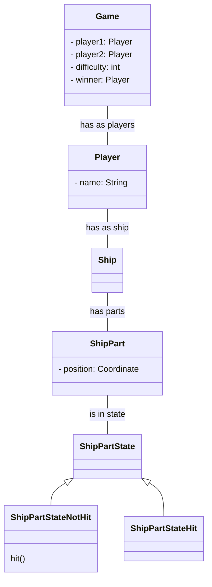

# Schiffe versenken
## Projektidee
Ein simples "Schiffe versenken" Spiel, welches zwei Spieler gegeneinander Spielen lässt. Das Spielfeld ist im Stil eines Rasters und die Schiffe werden durch durch ausgemalte Rasterkästchen repräsentiert. Man kann zwischen zwei Spielversionen auswählen und je nach Auswahl gibt es eine andere Konfiguration von Schiffen.
Wird ein gegnerisches Schiff getroffen, wird der Treffer bei beiden Spielern angezeigt. Sind alle Felder eines Schiffes getroffen, gilt dieses als versenkt.
Sind alle Schiffe eines Spielers versenkt hat er das Spiel verloren.

## Verwendete Design Patterns
- State Pattern
- Observer Pattern
- (Decorator Pattern)

## Klassendiagramm

## Technologien
- Java
- JAX-RS
- Tailwinds CSS
- HTML
- JavaScript
- JS Fetch
