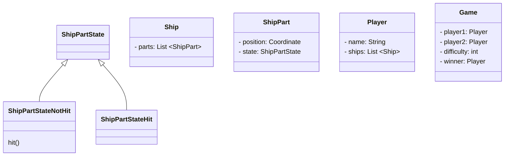

# Schiffe versenken
## Projektidee
Ein simples "Schiffe versenken" Spiel, welches zwei Spieler gegeneinander Spielen lässt. Das Spielfeld ist im Stil eines Rasters und die Schiffe werden durch durch ausgemalte Rasterkästchen repräsentiert.

## Verwendete Design Patterns
- State Pattern
- Observer Pattern
- (Decorator Pattern)

## Klassendiagramm

## Wireframes